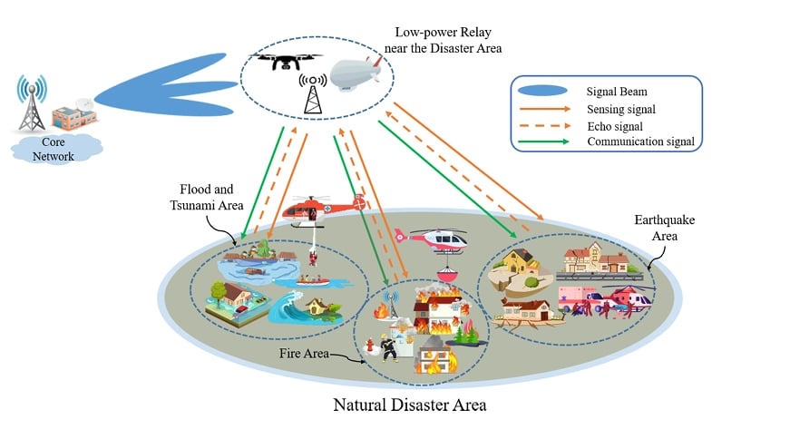

# Performance Analysis of ISAC-Assisted Wireless Systems with Energy Harvesting

This repository contains the graduation thesis titled "Performance analysis of ISAC-assisted wireless systems with energy harvesting" submitted by Nguyen Ba Linh to Hanoi University of Science and Technology.

---
### Thesis Overview

This thesis focuses on the performance analysis of wireless communication systems that integrate **Integrated Sensing and Communication (ISAC)** technology with **Energy Harvesting (EH)** capabilities. The work explores the theoretical and practical aspects of how these two advanced technologies can be synergistically combined to enhance the efficiency and sustainability of next-generation wireless networks.
System model: 

Key areas of investigation include:
* **Integrated Sensing and Communication (ISAC):** Investigating the paradigms where communication and sensing functionalities are co-designed and share common resources.
* **Energy Harvesting (EH):** Analyzing models and techniques for collecting energy from ambient sources to power wireless devices, thereby extending their operational lifespan and reducing reliance on traditional power sources.
* **Performance Metrics:** Evaluating various performance metrics such as throughput, sensing accuracy, energy efficiency, and outage probability in ISAC-assisted systems with EH.
* **System Optimization:** Exploring potential optimization strategies to maximize the benefits of integrating ISAC and EH.

### Thesis Content Description

This graduation thesis, "Performance Analysis of ISAC-Assisted Wireless Systems with Energy Harvesting," delves into the intricate interplay between two pivotal technologies for future wireless communication: **Integrated Sensing and Communication (ISAC)** and **Energy Harvesting (EH)**.

The work systematically analyzes the performance of wireless systems where sensing and communication functionalities are unified (ISAC), and devices are powered by ambient energy sources (EH). The core objective is to understand how these technologies can be synergistically combined to address the increasing demands for high data rates, ubiquitous connectivity, and sustainable network operation in next-generation wireless paradigms.

Key areas explored within the thesis include:

* **Introduction to ISAC:** A foundational understanding of ISAC principles, including the benefits of co-designing sensing and communication, and the challenges involved in resource allocation and interference management in such integrated systems.
* **Energy Harvesting Models:** Examination of various energy harvesting models relevant to wireless communication, detailing how energy can be efficiently captured from sources like radio frequency (RF) signals, solar, or wind, and converted into usable power for wireless devices.
* **System Model Development:** Construction of a robust system model that incorporates both ISAC functionalities (e.g., joint transmission for communication and sensing) and EH capabilities, often considering factors like channel conditions, energy arrival rates, and battery limitations.
* **Performance Metric Analysis:** A comprehensive evaluation of critical performance metrics tailored for ISAC-EH integrated systems. This typically includes:
    * **Throughput/Communication Rate:** Assessing the achievable data rates under various ISAC and EH configurations.
    * **Sensing Performance:** Analyzing metrics such as sensing accuracy, target detection probability, and resolution.
    * **Energy Efficiency:** Quantifying the efficiency of energy utilization for both communication and sensing tasks.
    * **Outage Probability:** Evaluating the likelihood of system failure due to insufficient energy or poor channel conditions.
* **Optimization Strategies:** Investigation and proposal of potential optimization techniques aimed at maximizing overall system performance (e.g., joint transmit power allocation, beamforming design, and time/power splitting for EH) while balancing communication and sensing objectives.
* **Simulation and Results:** Presentation of simulation results to validate the theoretical analysis and demonstrate the performance gains achieved by integrating ISAC and EH, often comparing different system configurations and scenarios.

The thesis aims to provide valuable insights into designing and implementing more efficient, reliable, and sustainable wireless networks by leveraging the combined strengths of integrated sensing and communication with advanced energy harvesting mechanisms.

---
